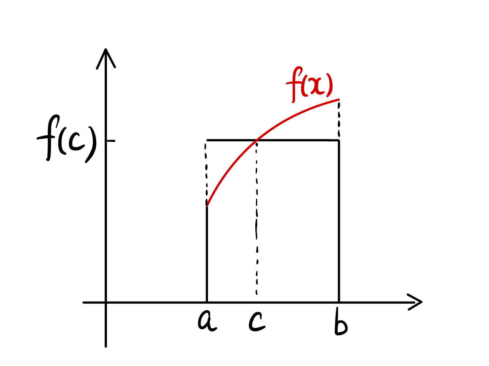
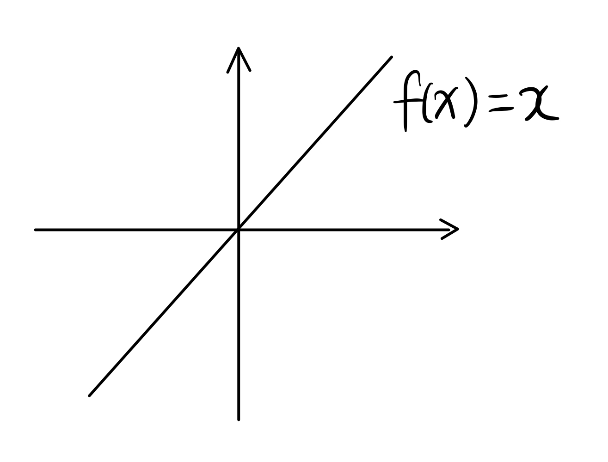
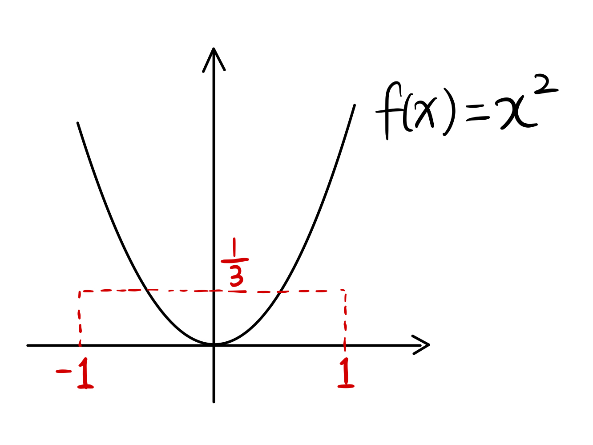
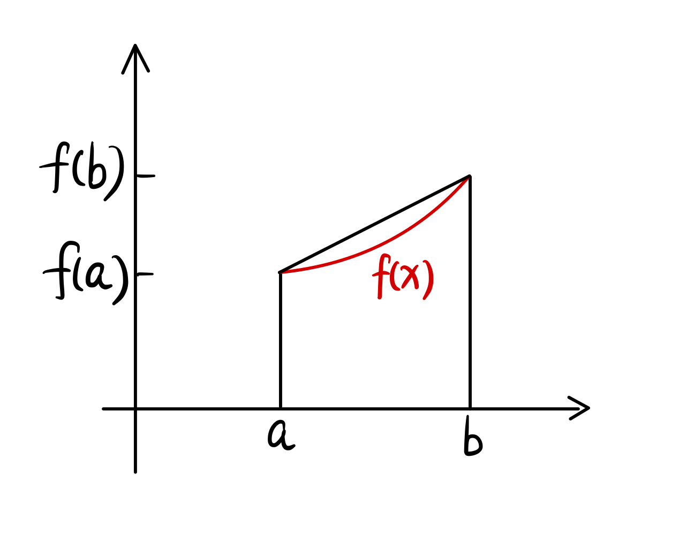
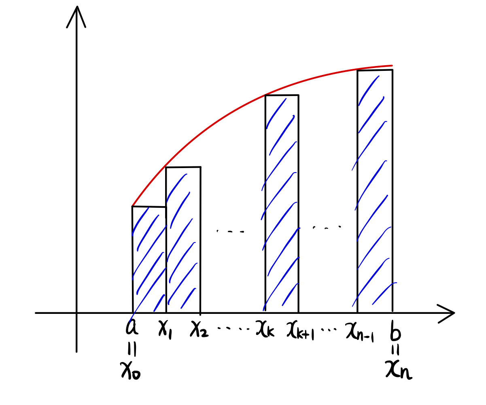
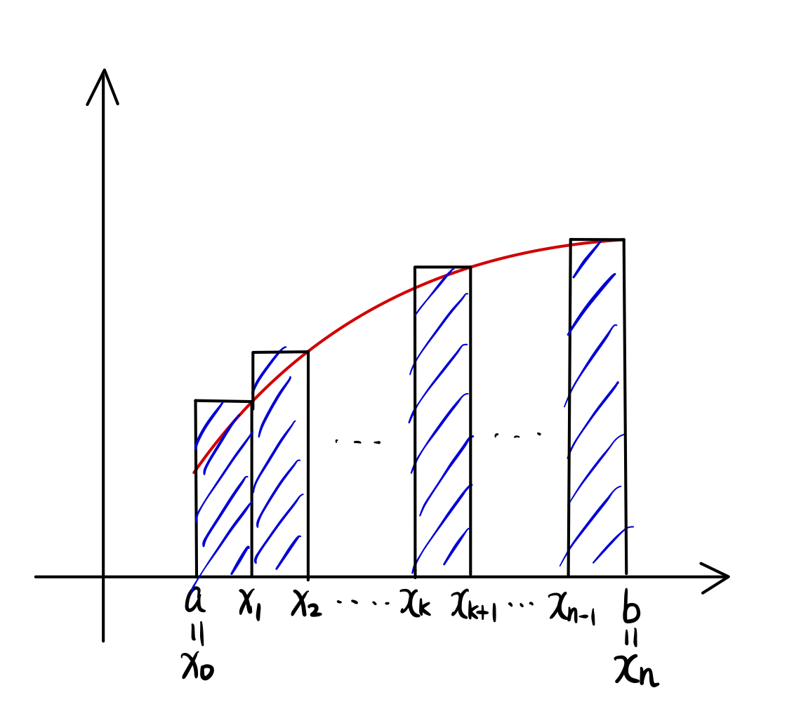
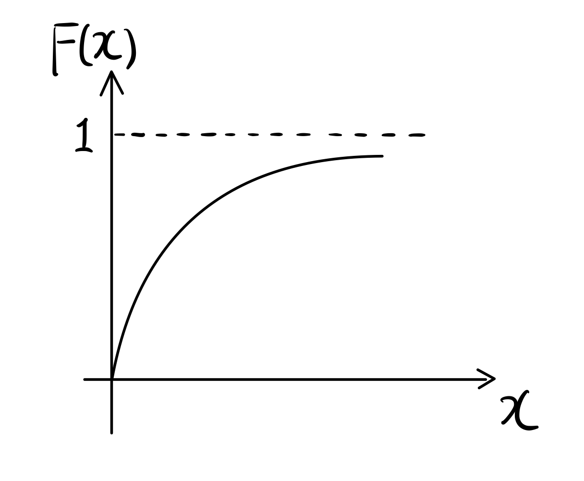
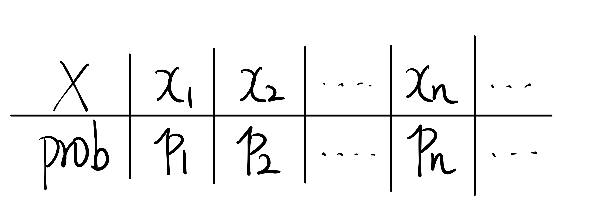
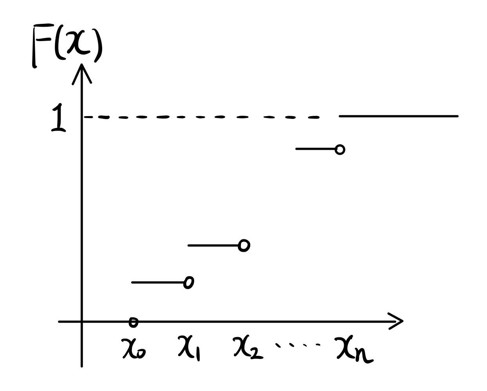

```{r setup, include=FALSE}
library(knitr)
options(width = 70) 
```

<p style="font-size:18px;font-weight:bold;">Summary of some of the prerequisite knowledge required for this subject:</p> 


The first two parts ([Mathematics](0-prerequisite-knowledge/#Mathematics) and [Probability](0-prerequisite-knowledge/#Probability)) below are basic reminders, and could probably be skipped by most students.

The [third part](0-prerequisite-knowledge/#probablility-theory-and-statistics-mw-12) is more advanced and corresponds to Section 1.2 of the prescribed textbook MW.

**Students are recommended to review all those concepts prior to week 1, and to ask questions at the week 1 tutorial if needed.**


# Mathematics


## Functions and their derivatives

1. Be familiar with functions $x^\alpha, e^{\alpha x}, \ln(1+x)$ 
1. Basic derivatives:
$$(x^\alpha)' = \alpha x^{\alpha - 1}$$
$$(e^{\alpha x})' = \alpha e^{\alpha x}$$ 
$$(\ln(1+x))' = \frac{1}{1+x}$$
$$(a^x)' = a^x \ln(a)$$
1. [``Taylor's expansion``](https://en.wikipedia.org/wiki/Taylor_series) (here for an exponential random variable):
$$e^x = 1 + x + \frac{x^2}{2!} + \frac{x^3}{3!} + ... + \frac{x^n}{n!} + ...$$


## Be able to find expressions for following summations

$$\sum_{i=1}^n x^i, \sum_{i=1}^n ix^i, \sum_{i=1}^n i$$
See Tutorial 0 (Revisions) for solutions.


## Change the order of double summation


$$\sum_{k=1}^n \sum_{j=1}^k a_{k,j} = \sum_{j=1}^n \sum_{k=j}^n a_{k,j} $$

## The solution to a quadratic equation

The equation 
$$ax^2 +bx+c = 0$$
has two solutions:

$$x_1 = \frac{-b+\sqrt{b^2-4ac}}{2a}, \quad\quad b^2 > 4ac$$
$$x_2 = \frac{-b-\sqrt{b^2-4ac}}{2a}, \quad\quad b^2 > 4ac$$

If $b^2 - 4ac$ = 0, the equation has a double solution: $x = \frac{-b}{2a}$

### Example

For example, find a value for $v$ such that $v \in (0,1)$ and $v$ satisfies the equation: $v - 2v^{0.5} + \dfrac{3}{4} = 0$.

Solution: let $v^{\frac{1}{2}} = x$. Then the equation above simplifies to $x^2 - 2x +\frac{3}{4} = 0$ which has two solutions:

$$x_1 = \frac{2+\sqrt{4-3}}{2} = 1.5, \ \ \ \ \ \ \ \ x_2 = \frac{2-\sqrt{4-3}}{2} = 0.5$$

We reject the solution $x_1 = 1.5$ as $x_1 > 1$. Then $v = x_2^2 = 0.5^2 = 0.25$ is the required solution.


## Be able to solve simple differential equations

### Example 1

For example, solve 
$$f'(x) = 2x$$
with initial condition $f(0)=1$.

Solution:

\begin{align*}
f(x) =& f(0) +  \int_0^x f'(t) dt \\
=& 1 + \int_0^x 2t dt \\
=&1 + t^2 \large |_0^x \\
=& 1+x^2
\end{align*}

### Example 2

Solve
$$f'(x) = 2f(x)$$
with initial condition $f(0)=1$.

Solution:

$$\frac{f'(x)}{f(x)} = 2 \Longleftrightarrow (\ln f(x))' = 2$$.
$$\Rightarrow \ln f(x) - \ln f(0) = \int_0^x (\ln f(t))' dt = \int_0^x 2 dt = 2x$$
$$\Rightarrow \ln f(x) = 2x \Rightarrow f(x) = e^{2x}$$


## Integrals


1. We have 
$$\int_a^b f(x) dx = F(b) - F(a),$$
where $F(x)$ is the anti-derivative of $f(x)$, such that $F'(x) = f(x)$.
1. The integration variable is just a tool, that is,
$$\int_a^b f(x) dx = \int_a^b f(y) dy,$$
it does not matter to use $x$ or $y$.
1. We have
$$$\int_0^{\infty} f(x) dx = \lim\limits_{b \rightarrow \infty} \int_0^{b} f(x) dx = \lim\limits_{b \rightarrow \infty} F(b) - F(0).$$ 
For example:
\begin{align*}
\int_0^{\infty} e^{-x} dx =&  \lim_{b \rightarrow \infty} \int_0^{b} e^{-x} dx \\
=& \lim_{b \rightarrow \infty} \left(-e^{-x} |_0^b\right )  \\
=& 1- \lim_{b \rightarrow a} e^{-b} \\
=& 1
\end{align*}
1. [``Integration by parts``](https://en.wikipedia.org/wiki/Integration_by_parts):
\begin{align*}
\int_a^{b} f(x)g'(x) dx =&  f(x)g(x) |_a^b - \int_a^{b} g(x)f'(x) dx \\
=& f(b)g(b) - f(a)g(a) - \int_a^{b} g(x)f'(x) dx
\end{align*}


## The average of a function on $[a,b]$

Let $f(x)$ be a continuous function on $[a,b]$. Then there exists a point $c \in [a,b]$ such that
$$\int_a^{b} f(x) dx = f(c)(b-a), \ \ \ \ \ \ \ \ c\in[a,b]$$

```{r, fig.align='center', out.width="30%", echo=F}

```

Interpretation: $\int_a^{b} f(x) dx$ is the area of the region enclosed by $f(x)$, $x$-axis, $x=a$, $x=b$. $f(c)(b-a)$ is the area of the rectangle of height $f(c)$ and length $(b-a)$.

Definition: $\frac{\int_a^{b} f(x) dx}{b-a} = f(c)$: the average value of $f(x)$ on $[a,b]$ interval.


### Example 1: 

$$\frac{\int_{-1}^{1} x dx}{2} = 0$$

```{r, fig.align='center', out.width="30%", echo=F}

```
The average value of $f(x) = x$ on $[-1,1]$ is 0.

### Example 2: 

$$\frac{\int_{0}^{1} x dx}{1-0} = \frac{1}{2}$$

```{r, fig.align='center', out.width="30%", echo=F}

```

The average value of $f(x) = x$ on $[0,1]$ is $\frac{1}{2}$.

### Example 3:

$$\frac{\int_{-1}^{1} x^2 dx}{2} = \frac{1}{3}$$
The average value of $f(x) = x^2$ on $[-1,1]$ is $\frac{1}{3}$.


## The trapezoid rule in integration


$$\int_{a}^{b} f(x) dx \approx \frac{1}{2}[f(b)+f(a)] (b-a)$$
$$\Longleftrightarrow \frac{\int_{a}^{b} f(x) dx}{b-a} \approx \frac{1}{2}[f(b)+f(a)]$$

```{r, fig.align='center', out.width="30%", echo=F}

```


The average value of $f(x)$ on $[a,b]$ can be approximated by $\frac{1}{2}[f(b)+f(a)]$.


## The definition of $\int_{a}^{b} f(x) dx$ and its numerical calculations


```{r, fig.align='center', out.width="50%", echo=F}

```

$$\int_{a}^{b} f(x) dx = \lim_{n \rightarrow \infty} \sum_{k=0}^{n-1} f(x_k)\frac{b-a}{n}, \quad\quad (1)$$
where $x_0 = a, x_1 = x_0 + \frac{b-a}{n}, ..., x_{k+1} = x_k + \frac{b-a}{n},..., x_n = b$

In the summation in $(1)$, each term represents the area of a rectangle. $f(x_k)\frac{b-a}{n}$ represents the area of the $k$-th rectangle.

Approximations:

1. $\int_{a}^{b} f(x) dx \approx f(a)(b-a) \ \ \ \ \ \ \ (n=1)$
1. $\int_{a}^{b} f(x) dx \approx \frac{b-a}{2} \left[f(a) + f\left(\frac{b+a}{2}\right)\right]$
1. $\int_{a}^{b} f(x) dx \approx (b-a)\frac{f(x_0)+f(x_1)+...+f(x_{n-1})}{n}$: the average of $f(x_0), f(x_1), ..., f(x_{n-1})$ times $(b-a)$.
1. If $a=0, b=1$, $\int_{0}^{1} f(x) dx \approx \frac{f(x_0)+f(x_1)+...+f(x_{n-1})}{n}$.

Alternatively,

```{r, fig.align='center', out.width="50%", echo=F}

```

$$\int_{a}^{b} f(x) dx = \lim_{n \rightarrow \infty} \sum_{k=1}^{n} f(x_k)\frac{b-a}{n} \quad\quad (2),$$
where $x_1 = x_0 +\frac{b-a}{n}, x_2 = x_1 +\frac{b-a}{n}, ..., x_n = b$.

Approximations:

1. $\int_{a}^{b} f(x) dx \approx f(b)(b-a)$
1. $\int_{a}^{b} f(x) dx \approx \frac{b-a}{2} \left[f\left(\frac{b+a}{2}\right)+ f(b)\right]$
1. $\int_{a}^{b} f(x) dx \approx (b-a)\frac{f(x_1)+f(x_2)+...+f(x_{n})}{n}$


## The average number of $n$ numbers

Let $x_1, x_2, ..., x_n$ be $n$ numbers. Then 
$$\frac{x_1+...+x_n}{n} = \frac{1}{n} \sum_{i=1}^n x_i$$
is the average value of $x_1,x_2,...,x_n$.

### Example 1

The average value of $1,2,...,n$ is 
$$\frac{1}{n} \sum_{i=1}^n i = \frac{1}{n}\frac{n(n+1)}{2} = \frac{n+1}{2},$$
where $1+2+3+...+n = \frac{n(n+1)}{2}$ is given in Tutorial 0.

### Example 2

One student took 8 subjects in his first year at University of Melbourne. The results are as follows: Semester 1: 75, 83, 65, 90; Semester 2: 60, 76, 80, 50.

Then 

- $75+83+65+90+60+76+80+50 = 579$ is the total marks from year 1.
- The average mark is $\frac{579}{8} = 72.4$
- The average mark for S1 is $\frac{75+83+65+90}{4} = 78.2$
- The average mark for S2 is $\frac{60+76+80+50}{4} = 66.5$


## The weighted average of $n$ numbers

Let $x_1, x_2, ..., x_n$ be $n$ real numbers.

Let $\theta_1, \theta_2, ...., \theta_n$ be $n$ numbers such that 
$$0 \leq \theta_i \leq 1 \quad\text{ and }\quad \sum_{i=1}^n \theta_i = 1.$$ 
Then 
$$\sum_{i=1}^n \theta_i x_i$$
is called the *weighted average* of $x_1, x_2, ..., x_n$.

Note:

- $\theta_i$ is the weight attached to $x_i$.
- if $\theta_i =\frac{1}{n}$, then 
$$\sum_{i=1}^n \frac{1}{n} x_i = \frac{1}{n} \sum_{i=1}^n x_i$$
is the average of $x_1, x_2, ..., x_n$ (equally weighted).

### Example

In the assessment of ACTL10001, the assignments account for 20%, the mid-semester exam accounts for 10%, and the final exam accounts for 70%. A student got 70 out of 100 for mid-semester result, 95 out of 100 for assignments, and 80 for final exam. Then the overall weighted average mark is
$$70 \times 10\% + 95 \times 20\% + 80 \times 70\% = 82.$$


# Probability

The following contents are the object of a video recorded in August 2021 for the subject ACTL10001 Introduction to Actuarial Studies: [``annotated pdf``](21-IAS-probability-video-notes.pdf)

<!--html_preserve-->
<iframe height="420" width="640" allowfullscreen frameborder=0 src="https://echo360.net.au/media/1f71f95e-16ff-44c0-8735-3f89bbd1b7ed/public?autoplay=false&automute=false"></iframe>
<!--/html_preserve-->

<p style="font-size:10px;color: rgb(252, 156, 249);"> If you wish to watch the embedded videos from Lecture Capture, you need to have logged in and <a href="https://canvas.lms.unimelb.edu.au/courses/145406/external_tools/701">entered Lecture Capture</a> via Canvas once for each session. This is to restrict access to students enrolled at the University of Melbourne only. </p>


## Events and Probability

### Vocabulary: events vs probability

It is important to understand the difference between events and probability:

- Event: what could happen - an actual "thing", in real life, that could happen;
- Probability: our understanding of the "likelihood" (or frequency) of an event (something that could occur).

So when we are building a mathematical model for uncertain outcomes:

1. The first step is to work out what are all the possible things that could occur (for instance, "rain" or "no rain"). The full set of those is denoted $\Omega$.
1. The second step is to make assumptions about how likely those things can occur. Here " $\Pr$ " is an operator that maps an event into a probability. For instance, $\Pr[\text{rain}]=0.2$ means that the likelihood corresponding to the event "rain" is 20%.

In what follows we outline basic results and axioms around events and their probabilities. Often logic means that a result or definition on one side (e.g. events) can be translated on the other side (e.g. probabilities).  
*For instance, the complement to an event is exactly whatever could happen, that is not the event. Hence, the probability of the complement must be 1 minus the probability of the original event; see 2.1.2.4 below.*

### Events, operations of events, probability of an event

1. $\emptyset$: empty set, that it, it is an impossible event: 
$$\Pr(\emptyset) = 0.$$
1. $\Omega$: the full set of possible outcomes, that is, it is a certain event: $$\Pr(\Omega) = 1.$$
1. $A$: an event (within $\Omega$), $0 \leq \Pr(A) \leq 1$.
1. $A^C$: the event that $A$ does not occur (called a "complement"): 
$$\Pr(A^C) = 1 - \Pr(A).$$
1. $A \cap B$: $A$ **and** $B$, the event that both $A$ and $B$ occur.
1. $A \cup B$: $A$ **or** $B$, the event that either $A$ or $B$, or both events occur.
1. $A \subseteq B$: If $A$ occurs, $B$ must, and:
    - $\Pr(A) \leq \Pr(B)$;
    - $A \cap B = A$.  
  Example: $A$ = {a 20-year old survives to age 70}, $B$ = {the 20-year old survives to age 50}. Then $A \subseteq B$.


### Mutually exclusive events

If 
$$A \cap B = \emptyset,$$ 
then $A$ and $B$ are **mutually exclusive**. Also,  
$$\Pr(A \cup B) = \Pr(A) + \Pr(B).$$


### Independent events $A$ and $B$

If $A$ and $B$ are independent, then 
$$\Pr(A \cap B) = \Pr(A)\Pr(B).$$

### Conditional probability formula

We have 

$$\Pr(A|B) = \frac{\Pr(A \cap B)}{\Pr(B)}.$$

This leads to Bayes' theorem, see for instance [``this``](https://en.wikipedia.org/wiki/Bayes%27_theorem).

Also, 

1. If $A \subseteq B$, then $A \cap B = A$ and
$$\Pr(A|B) = \frac{\Pr(A)}{\Pr(B)}.$$
1. If $A$ and $B$ are independent, then 
$$\Pr(A|B) = \frac{\Pr(A \cap B)}{\Pr(B)} = \frac{\Pr(A)\Pr(B)}{\Pr(B)} = \Pr(A).$$
1. If $B \subseteq A$, then $A \cap B = B$ and
$$\Pr(A|B) = \frac{\Pr(B)}{\Pr(B)} = 1.$$
Given $B$ has occurred, $A$ is certain.


## Random variables and their distribution

### Definition

A random variable, denoted by capital letters $X, Y, Z$, is a quantity whose value is subject to variations due to chance.

### Distribution Function

Definition: 
$$F(x) = \Pr(X \leq x) \ \ \ \ \ \ \ \ x\in \mathbb{R}$$
$F(x)$ is called the distribution function of $X$, and it has the following properties:

1. $F(-\infty) = 0, F(\infty) = 1$.
1. $F(x_1) \leq F(x_2)$, if $x_1 \leq x_2$.
1. $F(x)$ is right-continuous (aka "càdlàg"), i.e., $\lim_{x \rightarrow x_0^+} F(x) = F(x_0)$.
1. $F(b) - F(a) = \Pr (a < X \leq b)$.
1. $F(b-) - F(a) = \Pr (a < X < b)$.
1. $F(b) - F(a-) = \Pr (a \leq X \leq b)$.
1. $F(b) - F(b-) = \Pr (X = b) \ge 0$

In our subject, we generally assume that $X \geq 0$ so that $F(x) = 0$ for $x<0$.

### Difference betweeen continuous and discrete random variables

As an introduction to differences between continuous and discrete random variables, review this video:

<!--html_preserve-->
<iframe width="560" height="315" src="https://www.youtube.com/embed/bB11BCSXg0I" title="YouTube video player" frameborder="0" allow="accelerometer; autoplay; clipboard-write; encrypted-media; gyroscope; picture-in-picture" allowfullscreen></iframe>
<!--/html_preserve-->


### Continuous random variables ( $X \geq 0$ )

$X$ is said to be a continuous r.v. if $X$ has a probability density function $f(x)$, $x \geq 0$, with the following properties:

1. $f(x) = F'(x)$.
1. $F(x) = \int_{0}^x f(y) dy$.
1. $\Pr(a < X \leq b) = \Pr(a < X < b) = \Pr(a \leq X \leq b) = \Pr(a \leq X < b) = \int_{a}^b f(x) dx$
1. $F(x)$ typically looks like
```{r, fig.align='center', out.width="30%", echo=F}

```
but note that it does not need to be concave. 
1. $E(X) = \int_0^{\infty} xf(x) dx = \int_0^{\infty} [1-F(x)]dx$


### Discrete random variables

A random variable $X$ is said to be a discrete random variable if $X$ takes values from a countable set of numbers $\{x_1,x_2, ..., x_n, ...\}$.

1. Probability distribution of $X$
```{r, fig.align='center', out.width="30%", echo=F}

```
where $p_n = \Pr(X = x_n), n=1, 2, 3, ...$

2. $E(X) = \sum_{n=1}^{\infty} x_n \, p_n$
3. The distribution function $F(x)$ is a piece-wise constant function (also called step function).
```{r, fig.align='center', out.width="30%", echo=F}

```


## Moments of a random variable 

### Expectation and variance

Expectation of $X$:
$$E(X) = \int_0^{\infty} xf(x) dx.$$
Variance of $X$:
$$Var(X) = E\{[X-E(X)]^2\} = E(X^2) -[E(X)]^2.$$

Furthermore:

1. $Var(X)$ measures the variability of $X$. The larger the variance, the more variability $X$ has.
1. If $Var(X) = 0$, $X \equiv c \equiv E(X)$. There is no variability for $X$. $X$ is a constant.
1. If $X$ and $Y$ are independent, then 
$$Var(X+Y) = Var(X) + Var(Y).$$
1. $Var(aX)= a^2 Var(X)$

### Moments of the average of iid rv's
Assume $X_1, X_2, ..., X_n$ are independently and identically distributed, with $$E(X_1) = \mu,\text{ and } Var(X_1) = \sigma ^2.$$
Define 
$$Y_n = \frac{1}{n}(X_1+X_2+...+X_n)$$
to be the average of $X_1, X_2, ..., X_n$. Then 
$$E(Y_n) = \frac{1}{n}(E(X_1)+E(X_2)+...+E(X_n)) = \frac{1}{n}(\mu +\mu+...+\mu) =\mu$$ 
and
$$Var(Y_n) = \frac{1}{n^2}(Var(X_1) + Var(X_2) + ... +Var(X_n)) = \frac{1}{n^2}(\sigma^2+\sigma^2+...+\sigma^2) = \frac{\sigma^2}{n}.$$ 
When $n \rightarrow \infty$, $Var(Y_n) \rightarrow 0$. That is to say, as $n \rightarrow \infty$, $Y_n \rightarrow \mu$. With an infinite sample of $X$'s, you can estimate $\mu$ with certainty.

## Selected distributions

### Binomial distribution

If $X \sim Bin(n, p)$, then 
$$\Pr(X=k) = \binom{n}{k} p^k(1-p)^{n-k}, \ \ \ 0<p<1, k=0, 1, 2,..., n.$$

Note:

1. $E(X) = np$, $Var(X) = np(1-p)$.
1. $F(k) = \Pr(X\leq k) = \sum_{j=0}^k \Pr(X=j) = \sum_{j=0}^k {\binom{n}{j}} p^j (1-p)^{n-j}, \ \ \ k =0,1,2,...,n$.
1. $F(2.5) = \Pr(X \leq 2.5) = \Pr(X \leq 2) = F(2)$.
1. $X$ represents # of successes out of $n$ independent trials, each trail has two outcomes: sucess with probability $p$ OR failure with probability $1-p$.


### Exponential distribution

If $X \sim Exp(\lambda)$ then
$$f(x) = \lambda e^{-\lambda x}, x>0, \lambda>0.$$

Note:

1. $F(x) = 1-e^{-\lambda x}, x \geq 0$.
1. $E(X) = \int_0^{\infty} xf(x) dx = \int_0^{\infty} [1-F(x)] dx = \frac{1}{\lambda}$.


### Uniform distribution

If $X \sim U(0, M)$ then
$$f(x) = \frac{1}{M}, 0 \leq x \leq M.$$

Note:

1. $F(x) = \frac{x}{M}, 0 \leq x \leq M$.
1. $E(X) = \int_0^{M} x\frac{1}{M} dx = \int_0^{M} (1-\frac{x}{M})dx = \frac{M}{2}$.

# Probablility theory and statistics (MW 1.2)

Please review:
- Random variables and distribution functions (MW 1.2.1)
- Terminology in statistics (MW 1.2.2)

Tutorial exercises for Module 1 are focused on revisions of assumed known materials.


## Continuous vs discrete random variables

Random variables are either
- discrete
  - distribution function (**df**) is $\Pr[X\le x] \equiv F_X(x)$ (cadlag)
  - probability mass function (**pmf**) is $\Pr[X=x]$
- continuous
  - cumulative distribution function (**cdf**) is $F_X(x)$ (cadlag)
  - probability density function (**pdf**) is defined by $$f_X(x)\equiv\frac{d F_X(x)}{d x}.$$ This is **NOT** a probability.
- mixed

## The Riemann-Stieltjes integral
The **Riemann-Stieltjes** notation allows to write expressions for any type of rv. For instance,
$$E\left[ g\left( X\right) \right] =\int_{-\infty }^{\infty }g\left( x\right) dF_{X}\left(x\right),$$
where $dF_{X}\left(x\right)$ is to be interpreted as
- $f_X(x) dx$ for the continuous bits of $F$, and
- $F_X(x)-F_X(x-0)=\Pr[X=x]$ (remember $F$ is cadlag) for the discrete bits of $F$.

## Moments of random variables
There are two types of moments:

- the moments **around the origin**: $E[X^k]$, $k>0$
    - $k=1$: the mean
    $$E\left( X\right) =\mu _{X}=\int_{-\infty }^{\infty}xdF_{X}\left( x\right)$$
- the  **central** moments: $E\left[(X - E [X])^k\right]$, $k>0$
    - $k=2$: the variance
    $$Var\left( X\right) =\sigma _{X}^{2}=E\left[\left( X-\mu _{X}\right) ^{2}\right] =E\left( X^{2}\right) -\mu_{X}^{2}$$

Some extremely useful formulas:
\begin{eqnarray}
E[S] &=& E\left[ E[S|N] \right] &\quad\text{(LIE)}\\
Var(S) &=& Var\left( E[S|N] \right) + E\left[ Var(S|N) \right] &\quad\text{(DVR)}\\
Cov(X,Y) &=& E\left[ Cov(X,Y|Z) \right] + Cov\left( E[X|Z],E[Y|Z]\right) &\quad\text{(DCR)}
\end{eqnarray}

## Tail value method of calculating expectation

For positive random variables we have
$$E[X]=\left\{
\begin{array}{ll}
  \int_0^\infty \left[1-F_X(x)\right] dx & \text{if }X\text{ is continuous} \\
  \sum_0^\infty \left[1-F_X(x)\right]   & \text{if }X\text{ is discrete}
\end{array}\right.$$

## Descriptive statistics

Some indicators are functions of the moments
- **Coefficient of variation** (measure of spread): $$\text{Vco}(X)=\frac{\sigma_X}{\mu_X}.$$
- **Skewness** (measure of... skewness!): $$\varsigma_X=\dfrac{E\left[ \left( X-\mu _{X}\right) ^{3}\right] }{\sigma _{X}^{3}}.$$
  - If symmetric, $\varsigma_X=0$ [vice versa not true]
  - $\varsigma_X>0$ indicates heavy right-tail [skewed to the right]
  - $\varsigma_X<0$ indicates heavy left-tail [skewed to the left]

---

\item **Excess Kurtosis** (measure of peakedness) $$\gamma_2(X)=\dfrac{E\left[ \left( X-\mu _{X}\right) ^{4}\right] }{\sigma _{X}^{4}}-3.$$
  - $\gamma _2(X)=0$ mesokurtic [like Normal, Binomial $(p=0.5)$ ]
  - $\gamma _2(X)>0$ leptokurtic [fatter tails]
  - $\gamma _2(X)<0$ platykurtic [thinner tails]

Note that these indicators have **no units**, which allows comparisons between distributions.

## Generating functions 

Probability generating function **pgf**---**only** for discrete rv!
\begin{eqnarray}
p_{X\left( t\right)}&=&E\left( t^{X}\right) \\
&=&\Pr[X=0]+\Pr[X=1] t+ \Pr[X=2]  t^2 +\Pr[X=3]  t^3 + \ldots
\end{eqnarray}
Moment generating function **mgf**
\begin{eqnarray}
M_{X\left( t\right)}&=&E\left( e^{tX}\right) \\
&=&1+E[X] t+ E[X^2]  \frac{t^2}{2} +E[X^3] \frac{t^3}{6} + \ldots + E[X^k] \frac{t^k}{k!}+\ldots
\end{eqnarray}
and thus
$$E[X^k]=\left.\dfrac{d^{k}}{dt^{k}}m_{X}\left( t\right) \right|_{t=0}$$

---

Example: $X\sim\text{norm}(\mu,\sigma^2)$ distribution

$$E\left[ e^{tX} \right] = e^{\mu t + \frac{1}{2}\sigma^2t^2}$$

---

Cumulant generating function **cgf**
\begin{eqnarray}
\kappa _{X\left( t\right)} &=& \ln\left[ m_{X}\left( t\right) \right] \\
&=&E[X] t+ Var(X)  \frac{t^2}{2} +E\left[ (X-\mu_X)^3\right] \frac{t^3}{6} + \gamma_2(X)\left[Var(X)\right]^2\frac{t^4}{4!}+\ldots^*
\end{eqnarray}
and thus
$$E\left[ (X-\mu_X)^k\right]=\left.\dfrac{d^{k}}{dt^{k}}\kappa_{X}\left( t\right) \right|_{t=0},\;\;\;\;**k=2 \text{ and **3}^*.$$
  - **CAUTION**: the second and third cumulants are the second and third central moments, but NOT the following ones!
  - Cumulants are additive: the $k$-th cumulant of a sum is the sum of the $k$-th cumulants (conditions?)


<!-- # References {.allowframebreaks} -->

@: References: [MW](https://papers.ssrn.com/sol3/papers.cfm?abstract_id=2319328) 1

# Use of the R software 

R is required prior knowledge for this course, and part of the prerequisite course MAST20005 (Statistics).

This is because R is a required software for the actuarial professional exams CS1 and CS2 (see https://www.actuaries.org.uk/studying/curriculum/actuarial-statistics and also https://www.actuaries.org.uk/studying/curriculum/frequently-asked-questions-curriculum ). It is used very widely by actuaries in industry (see, for instance, http://insightriskconsulting.co.uk/blog/r-for-actuaries/ or https://www.actuaries.digital/2019/09/26/my-top-10-r-packages-for-data-analytics/ ). Some companies also use R to produce presentations and documentation for generally.

In order to help you with R I have put together a website that summarises all the things I think you should know before starting your first grad role:
https://communicate-data-with-r.netlify.app
At the very least, you need to know what is under "Base R". Learning the "tidyverse" will be most useful, as well as "ggplot2" for better visualisations. "htmlwidgets" is more advanced, and not required for the course. You may want to create your assignment with "R Markdown" (under "Communicate Data"), although this is not required either.

The main reference for Base R is the book http://biostatisticien.eu/springeR/index-en.html, which is also available in other languages (including mandarin). The English version can be downloaded for free from the Unimelb library: https://go.openathens.net/redirector/unimelb.edu.au?url=http%3A%2F%2Fdx.doi.org%2F10.1007%2F978-1-4614-9020-3 

I strongly recommend you review the R materials mentioned above before the semester starts.

See also the Actuaries Institute Analytics Cookbook:
https://www.actuaries.digital/2021/11/30/the-actuaries-analytics-cookbook-recipes-for-data-success/ 
https://actuariesinstitute.github.io/cookbook/docs/index.html

# Credit

The initial version of Part 1 and 2 were developed by Professor Shuanming Li in 2018. These were then transcribed modified and augmented by Professor Benjamin Avanzi in 2021 for the subject [ACTL10001](https://actl10001.netlify.app/).