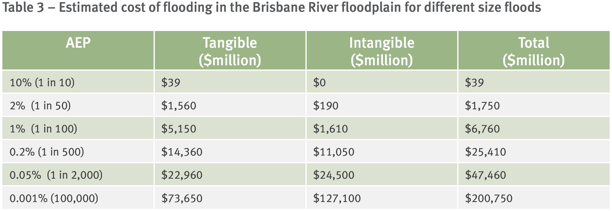
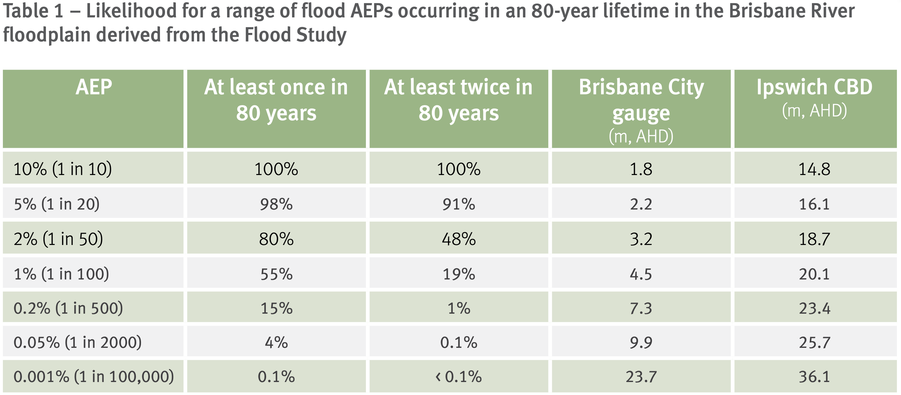

# Introduction

## Extreme events

- financial (and claims) data has often leptokurtic severity (more peaked - heavy tailed - than normal)
- reasons include heteroscedasticity (stochastic volatility)
- almost by definition, extreme events happen with low frequency
- but extreme events are the ones leading to financial distress, possibly ruin
- accurate fitting is crucial for capital and risk management (risk based capital, reinsurance, ART such as securitisation via CAT bonds)
- fitting presents specific issues:
  - there is little data to work from
  - when fitting a whole distribution, the big bulk of the data (around the mode) overpowers observations in the tails in the optimisation routine (MLE), leading to poor fit in the tail
  - sometimes (in fact, almost always) a good distribution for the far tail is different from that for the more common outcomes.

## Framework

- Consider iid random variables `\(X_i\)`, `\(i=1,\ldots,n\)`, with df `\(F\)`
- We denote the order statistics
  `$$X_{n,n} \le X_{n-1,n} \le \ldots \le X_{1,n}$$`
  such that
  `$$X_{n,n}=\min(X_1,\ldots,X_n) \text{ and }X_{1,n}=\max(X_1,\ldots,X_n).$$`
- Specifically, we may be interested in
  `$$\begin{array}{rcl} \text{average of }k\text{ largest losses} &=& \displaystyle \sum_{r=1}^k\frac{X_{r,n}}{k} \\ \text{empirical mean excess function above }u &=& \displaystyle \sum_{r=1}^{n_u}\frac{(X_{r,n}-u)}{n_u},\text{where} \\ n_u = \# \left\{ 1\le r\le n:X_r>u\right\}& \end{array}$$`

<!-- `\(n_u = \# \left\{ 1\le r\le n:X_r>u\right\}\)` -->

## Motivating example (Paul Embrechts, Resnick, and Samorodnitsky 1999)

Consider the following situation:

- Let `\(X_i\)` be exponential mean `\(1/\lambda=10\)`
- We have `\(n=100\)` observations
- The maximum observed was 50. How likely is it if the model is correct? What if the maximum had been 100?

The probability that the maximum `\(X_{1,n}\)` is at least `\(x\)` is
`$$\Pr[X_{1,n}>x] =1-\left( \Pr[X\le x]\right)^{100} = 1-\left( 1-e^{-x/10}\right)^{100},$$`
and hence
`$$\begin{array}{rcl} \Pr[X_{1,n}>50] &=& 0.4919, \\ \Pr[X_{1,n}>100] &=& 0.00453. \end{array}$$`

## A limiting argument

We now perform the following calculations:
`$$\Pr\left[ \frac{X_{1,n}}{\alert{10}}-\alert{\log n}\le x\right] = \Pr [X_{1,n} \le 10(x+\log n)] = \left(1-\frac{e^{-x}}{n}\right)^n,$$`
where the elements in red were chosen based on an educated guess, so that
`$$\lim_{n\rightarrow\infty} \Pr\left[\frac{X_{1,n}}{\alert{10}}-\alert{\log n} \le x\right]=\lim_{n\rightarrow\infty} \left(1-\frac{e^{-x}}{n}\right)^n=e^{-e^{-x}} \equiv \Lambda(x),$$`
which is the df of a Gumbel (or double exponential) random variable.

### General result for `\(X\)` exponential `\((\lambda)\)`

We can easily generalise the previous result to any `\(\lambda\)` and `\(n\)`. Noting that 10 was actually `\(1/\lambda\)` before, we had in summary
`$$\Pr [X_{1,n} \le (x+\log n)/\lambda] \approx \Lambda(x).$$`
If we set
$$ y = (x+\log n)/\lambda$$
then we get
`$$\Pr[X_{1,n}\le y] \approx \Lambda \left( \lambda y -\log n\right).$$`
In the limit `\((n \rightarrow \infty)\)`, the approximation is exact.

This means that for large `\(n\)`, one can approximate the distribution of the maximum of a set of iid exponentially distributed `\(X_i\)`’s (with parameter `\(\lambda\)`) with a Gumbel distribution.

------------------------------------------------------------------------

Indeed, this works well for our example, especially in the tail:
`$$\begin{array}{rcl} \Pr[X_{1,n}>50] &\approx& 1-e^{-e^{-(50/10-\log 100)}}=0.4902, \\ \Pr[X_{1,n}>100] &\approx& 0.00453. \end{array}$$`

### Questions

- This is nice, but not all random variables are exponential.
- Can we generalise such a limiting approach to any df?

**Yes!**

- Can we find norming constants (such as `\(\lambda\)` and `\(\log n\)` in the exponential case) in general?  
  That is, how do we find `\(a_n\)` and `\(b_n\)` so that
  `$$\lim_{n\rightarrow \infty} \Pr \left[ \frac{X_{1,n}-b_n}{a_n} \le x\right]$$`
  exists?

**We can!** (there are only three cases to consider), but we won’t discuss that here (see, e.g., P. Embrechts, Klüppelberg, and Mikosch 1997 for the proofs)

# Generalised Extreme Value distribution

## The GEV distribution

### Parallel with CLT

<font color='red'>The theoretical results of the previous section lead to an extreme value complement or homologue, for the tails, of the CLT approximation (which works only around the middle of the distribution).</font>

- In the exponential example, the “normalised” maximum
  $$ \frac{X_{1,n}}{\text{mean of X}} - \log n$$
  for infinite sample `\(n\)` stabilised to a Gumbel distribution `\(\Lambda\)`.
- This generalises to any distribution for `\(X\)` - the distribution of the normalised maximum then becomes a “Generalised Extreme Value” distribution, a special case of which is the Gumbel distribution.

### Extreme Value Distributions

The Gumbel distribution `\(\Lambda(x)\)` derived earlier is a special case of a general distribution family
`$$H_{\gamma;\mu,\sigma}(x)=\exp \left\{ - \left(1+\gamma\frac{x-\mu}{\sigma}\right)_+^{-\frac{1}{\gamma}}\right\},\;\gamma \in \mathbb{R}, \mu\in\mathbb{R}, \sigma>0.$$`
This Generalised Extreme Value distribution (GEV) encompasses **all** extreme value distributions, of which we distinguish three cases:

- `\(\gamma<0\)`: upper bounded Weibull (Sometimes referred to as the reverse or reflected Weibull) df with `\(x<\mu-\sigma/\gamma\)`
- `\(\gamma=0\)`: Gumbel df with `\(x\in \mathbb{R}\)`
- `\(\gamma>0\)`: Fréchet-type df with `\(x>\mu- \sigma/\gamma\)`

The last one relates to the heavy tailed distributions (typically with moments existing only up to a certain order, infinite afterwards),  
and is the most relevant to actuarial applications.

### Three cases


(Unit 4, Page 4, IoA 2020) Note `\(\alpha \equiv \mu\)` and `\(\beta \equiv \sigma\)`

------------------------------------------------------------------------

``` r
GenEV <- function(x, alpha, beta, gamma) {
  1/beta * (1 + gamma * (x - alpha)/beta)^(-(1 + 1/gamma)) *
    exp(-((1 + gamma * (x - alpha)/beta)^(-1/gamma)))
}
par(mfrow = c(1, 3), oma = c(0, 0, 3, 0))
plot(-4000:2000/1000, GenEV(-4000:2000/1000, 0, 1, -0.5), main = "Density with gamma=-0.5 (Weibull)",
  xlim = c(-4, 4), xlab = "", ylab = "", cex = 1)
plot(-4000:4000/1000, GenEV(-4000:4000/1000, 0, 1, 1e-05), main = "Density of GEV with gamma=0 (Gumbel)",
  xlim = c(-4, 4), xlab = "", ylab = "", cex = 1)
plot(-2000:4000/1000, GenEV(-2000:4000/1000, 0, 1, 0.5), main = "Density of GEV with gamma=0.5 (Fréchet)",
  xlim = c(-4, 4), xlab = "", ylab = "", cex = 1)
mtext("Density of GEV with mu=0, sigma=1, and various values of gamma",
  outer = TRUE, cex = 1.5)
```

------------------------------------------------------------------------

}}index_files/figure-html/3cases-1.png" width="672" />

### Estimation: Block Maxima

- The EVD is a distribution of maxima
- To fit it we need a sample of maxima
- To achieve this, the data is transformed into block maxima
  1.  assume we have `\(n\)` data points
  2.  consider blocks of length `\(m\)`
  3.  the block maxima are the equal to the maximum observation within a block
  4.  we have then a sample size of `\(n/m\)`
- The block maxima are then fitted to the EVD
- The larger the block size, the closer to the asymptotic distribution we get, but the less data we have: conflicting requirements
- In R, this can be done efficiently with the function `fevd` of the package `extRemes` (Gilleland and Katz 2016)

## Case study - data

### Data sets

We consider three simulated data sets with `\(n=12000\)` (provided along with the lecture notes), expected value \$ `\(10,\!000\)` and variance \$ `\(9,\!000^2\)`:

|    month     |     beta |     gamm |     logg |
|:------------:|---------:|---------:|---------:|
| `\(\vdots\)` |          |          |          |
|      61      | 12862.84 | 33493.02 | 18773.47 |
|      62      |   408.64 |  6070.20 |  7564.21 |
|      63      |  2404.87 | 26093.36 |  5083.10 |
|      64      |  4753.73 |  3773.61 |  2070.88 |
|      65      |   594.57 |  3885.25 | 43601.62 |
|      66      | 16805.64 |  6881.97 |  6163.90 |
|      67      |  4335.52 |  5163.38 |  8158.35 |
|      68      |  5575.15 | 24401.76 | 19172.13 |
| `\(\vdots\)` |          |          |          |

------------------------------------------------------------------------

``` r
claims <- as_tibble(read_excel("simulated-claims.xlsx"))
summary(claims$beta)
```

    ##    Min. 1st Qu.  Median    Mean 3rd Qu.    Max. 
    ##       0    2102    7585   10078   16532   33287

``` r
summary(claims$gamm)
```

    ##     Min.  1st Qu.   Median     Mean  3rd Qu.     Max. 
    ##     6.12  3566.46  7668.73 10107.70 14070.25 90712.14

``` r
summary(claims$logg)
```

    ##     Min.  1st Qu.   Median     Mean  3rd Qu.     Max. 
    ##    432.7   4611.7   7374.7   9931.9  12124.2 157377.1

------------------------------------------------------------------------

``` r
plotdist(claims$beta)
```

}}index_files/figure-html/casestudy2-1.png" width="672" />

------------------------------------------------------------------------

``` r
plotdist(claims$gamm)
```

}}index_files/figure-html/casestudy3-1.png" width="672" />

------------------------------------------------------------------------

``` r
plotdist(claims$logg)
```

}}index_files/figure-html/casestudy4-1.png" width="672" />

### Block maxima

Creating block maxima

``` r
# block maxima index
claims$block <- (claims$month - 1)%/%12 + 1
# %/% gives the integer part of the result of the division
blockmax <- tibble(betablock = aggregate(beta ~ block, claims,
  max)$beta, gammblock = aggregate(gamm ~ block, claims, max)$gamm,
  loggblock = aggregate(logg ~ block, claims, max)$logg)
# have a look at what the aggregate function does
```

We now have a sample of `\(12000/12=1000\)` block maxima.

What do these look like in comparison with the original data?

------------------------------------------------------------------------

``` r
claims <- as_tibble(read_excel("simulated-claims.xlsx"))
summary(blockmax$betablock)
```

    ##    Min. 1st Qu.  Median    Mean 3rd Qu.    Max. 
    ##   11376   23803   27155   26606   30035   33287

``` r
summary(blockmax$gammblock)
```

    ##    Min. 1st Qu.  Median    Mean 3rd Qu.    Max. 
    ##    9521   21036   27278   28479   34299   90712

``` r
summary(blockmax$loggblock)
```

    ##    Min. 1st Qu.  Median    Mean 3rd Qu.    Max. 
    ##    9326   18618   24590   28587   33259  157377

------------------------------------------------------------------------

``` r
plotdist(blockmax$betablock)
```

}}index_files/figure-html/blockmaxima3-1.png" width="672" />

------------------------------------------------------------------------

``` r
plotdist(blockmax$gammblock)
```

}}index_files/figure-html/blockmaxima4-1.png" width="672" />

------------------------------------------------------------------------

``` r
plotdist(blockmax$loggblock)
```

}}index_files/figure-html/blockmaxima5-1.png" width="672" />

------------------------------------------------------------------------

``` r
par(mfrow = c(1, 2))
plot(density(claims$beta), main = "Density of the beta claims",
  xlab = "Claim amounts ($)", xlim = c(0, max(claims$beta)))
plot(density(blockmax$betablock), main = "Density of the beta block maxima",
  xlab = "Maximums over consecutive periods of 12 months ($)",
  xlim = c(0, max(claims$beta)))
```

}}index_files/figure-html/blockmaxima6-1.png" width="672" />

------------------------------------------------------------------------

``` r
par(mfrow = c(1, 2))
plot(density(claims$gamm), main = "Density of the gammormal claims",
  xlab = "Claim amounts ($)", xlim = c(0, max(claims$gamm)))
plot(density(blockmax$gammblock), main = "Density of the gammormal block maxima",
  xlab = "Maximums over consecutive periods of 12 months ($)",
  xlim = c(0, max(claims$gamm)))
```

}}index_files/figure-html/blockmaxima7-1.png" width="672" />

------------------------------------------------------------------------

``` r
par(mfrow = c(1, 2))
plot(density(claims$logg), main = "Density of the log-gamma claims",
  xlab = "Claim amounts ($)", xlim = c(0, max(claims$logg)))
plot(density(blockmax$loggblock), main = "Density of the log-gamma block maxima",
  xlab = "Maximums over consecutive periods of 12 months ($)",
  xlim = c(0, max(claims$logg)))
```

}}index_files/figure-html/blockmaxima8-1.png" width="672" />

<!-- --- -->
<!-- ```{r blockmaxima9,fig.height=5} -->
<!-- par(mfrow=c(1,2)) -->
<!-- plot(density(log(claims$logg)),main="Density of the log-gamma claims",xlab="Claim amounts ($)",xlim=c(0,max(log(claims$logg)))) -->
<!-- plot(density(log(blockmax$loggblock)),main="Density of the log-gamma block maxima",xlab="Maximums over consecutive periods of 12 months ($)",xlim=c(0,max(log(claims$logg)))) -->
<!-- ``` -->

------------------------------------------------------------------------

``` r
par(mfrow = c(1, 3))
plot(density(blockmax$betablock), main = "Density of the beta block maxima",
  xlab = "Maximums over consecutive periods of 12 months ($)")
plot(density(blockmax$gammblock), main = "Density of the gammormal block maxima",
  xlab = "Maximums over consecutive periods of 12 months ($)")
plot(density(blockmax$loggblock), main = "Density of the loggamma block maxima",
  xlab = "Maximums over consecutive periods of 12 months ($)")
```

}}index_files/figure-html/blockmaxima10-1.png" width="672" />

## Case study - fitting

### Fitting results

For example for the `logg` BM we use the following code:

- `fit.logg <- fevd(blockmax$loggblock)` will perform the fit
- `fit.logg` will display the results of the fitting
- `plot(fit.logg)` will plot goodness of fit graphical analysis
- `plot(fit.logg,"trace")` will plot the likelihood function around the chosen parameters

More details can be found in Gilleland and Katz (2016).

------------------------------------------------------------------------

Results (MLE with standard errors in parentheses) are

|          | location `\(\mu\)` | scale `\(\sigma\)` | shape `\(\gamma\)` |
|----------|--------------------|--------------------|--------------------|
| beta     | 25644.93 (163.26)  | 4695.76 (130.07)   | -0.6012 (0.0212)   |
| gamma    | 24069.68 (288.51)  | 8225.98 (215.80)   | -0.0243 (0.0222)   |
| loggamma | 21466.22 (305.26)  | 8496.86 (251.97)   | 0.2299 (0.0278)    |

Note:

- These correspond to the three distinct cases introduced before as expected (look at the sign of `\(\gamma\)`)
- Whether `\(\gamma\neq 0\)` for gamma can be formally tested in different ways (see Gilleland and Katz 2016), but the standard error for `\(\gamma^{\text{gamm}}\)` suggests a null hypothesis of `\(\gamma^{\text{gamm}} = 0\)` would not be rejected.

------------------------------------------------------------------------

``` r
fit.beta <- fevd(blockmax$betablock)
fit.beta
...
##  Estimated parameters:
##      location         scale         shape 
## 25644.9318770  4695.7556362    -0.6011579 
## 
##  Standard Error Estimates:
##     location        scale        shape 
## 163.26448100 130.06953700   0.02120487 
## 
##  Estimated parameter covariance matrix.
##              location        scale         shape
## location 26655.290757 -8463.804100 -1.2827274803
## scale    -8463.804100 16918.084456 -1.7746705470
## shape       -1.282727    -1.774671  0.0004496465
## 
##  AIC = 19385.23 
## 
##  BIC = 19399.96
...
```

------------------------------------------------------------------------

``` r
plot(fit.beta)
```

}}index_files/figure-html/block-fitbeta2-1.png" width="672" />

------------------------------------------------------------------------

``` r
plot(fit.beta, "trace")
```

}}index_files/figure-html/block-fitbeta3-1.png" width="672" />

------------------------------------------------------------------------

``` r
fit.gamm <- fevd(blockmax$gammblock)
fit.gamm
...
##  Estimated parameters:
##      location         scale         shape 
##  2.406968e+04  8.225984e+03 -2.428561e-02 
## 
##  Standard Error Estimates:
##     location        scale        shape 
## 288.51126800 215.80132748   0.02220903 
## 
##  Estimated parameter covariance matrix.
##              location        scale         shape
## location 83238.751764 21650.966827 -2.0732936569
## scale    21650.966827 46570.212942 -1.4944274045
## shape       -2.073294    -1.494427  0.0004932409
## 
##  AIC = 21127.17 
## 
##  BIC = 21141.89
...
```

------------------------------------------------------------------------

``` r
plot(fit.gamm)
```

}}index_files/figure-html/block-fitgamm2-1.png" width="672" />

------------------------------------------------------------------------

``` r
plot(fit.gamm, "trace")
```

}}index_files/figure-html/block-fitgamm3-1.png" width="672" />

------------------------------------------------------------------------

``` r
fit.logg <- fevd(blockmax$loggblock)
fit.logg
...
##  Estimated parameters:
##     location        scale        shape 
## 21466.224267  8496.863050     0.229869 
## 
##  Standard Error Estimates:
##     location        scale        shape 
## 305.26319626 251.96813338   0.02779193 
## 
##  Estimated parameter covariance matrix.
##              location        scale         shape
## location 93185.618989 45516.589594 -2.5704729001
## scale    45516.589594 63487.940241 -0.5065090268
## shape       -2.570473    -0.506509  0.0007723913
## 
##  AIC = 21491.68 
## 
##  BIC = 21506.4
...
```

------------------------------------------------------------------------

``` r
plot(fit.logg)
```

}}index_files/figure-html/block-fitlogg2-1.png" width="672" />

------------------------------------------------------------------------

``` r
plot(fit.logg, "trace")
```

}}index_files/figure-html/block-fitlogg3-1.png" width="672" />

## Case study - choice of block size

Remember that

- the larger the block, the closer we are to the limiting distribution  
  (this is good)

However

- the larger the block, the least data we have  
  (this is bad)

Here we aim to illustrate the impact on the parameter estimates of increasing block sizes.

### Convergence with increasing block sizes

``` r
# block sizes
blocksizes <- c(1, 2, 3, 4, 6, 12, 18, 24, 30, 60, c(1:20 * 120))
results <- c()
for (i in blocksizes) {
  # number of full blocks to work with
  numbers <- floor(length(claims$beta)/max(blocksizes))
  # trimming claims vector
  claims_trimmed <- claims[1:(numbers * i), ]
  # block maxima
  claims_trimmed$block <- (claims_trimmed$month - 1)%/%i +
    1
  blockmax2 <- tibble(betablock2 = aggregate(beta ~ block,
    claims_trimmed, max)$beta, gammblock2 = aggregate(gamm ~
    block, claims_trimmed, max)$gamm, loggblock2 = aggregate(logg ~
    block, claims_trimmed, max)$logg)
  # fitting
  fit.beta2 <- fevd(blockmax2$betablock2)
  fit.gamm2 <- fevd(blockmax2$gammblock2)
  fit.logg2 <- fevd(blockmax2$loggblock2)
  results <- rbind(results, c(i, as.double(fit.beta2$results$par[1:3]),
    as.double(fit.gamm2$results$par[1:3]), as.double(fit.logg2$results$par[1:3])))
}
```

------------------------------------------------------------------------

``` r
par(mfrow = c(1, 3))
plot(results[, 1], results[, 2], pch = 20, main = "Convergence of mu (betablock)",
  xlab = "Block size")
plot(results[, 1], results[, 3], pch = 20, main = "Convergence of sigma (betablock)",
  xlab = "Block size")
plot(results[, 1], results[, 4], pch = 20, main = "Convergence of gamma (betablock)",
  xlab = "Block size")
```

``` r
par(mfrow = c(1, 3))
plot(results[, 1], results[, 5], pch = 20, main = "Convergence of mu (gammblock)",
  xlab = "Block size")
plot(results[, 1], results[, 6], pch = 20, main = "Convergence of sigma (gammblock)",
  xlab = "Block size")
plot(results[, 1], results[, 7], pch = 20, main = "Convergence of gamma (gammblock)",
  xlab = "Block size")
```

``` r
par(mfrow = c(1, 3))
plot(results[, 1], results[, 8], pch = 20, main = "Convergence of mu (loggblock)",
  xlab = "Block size")
plot(results[, 1], results[, 9], pch = 20, main = "Convergence of sigma (loggblock)",
  xlab = "Block size")
plot(results[, 1], results[, 10], pch = 20, main = "Convergence of gamma (loggblock)",
  xlab = "Block size")
```

------------------------------------------------------------------------

}}index_files/figure-html/blockfit1-1.png" width="672" />

------------------------------------------------------------------------

}}index_files/figure-html/blockfit2-1.png" width="672" />

------------------------------------------------------------------------

}}index_files/figure-html/blockfit3-1.png" width="672" />

## Moments

Let `\(Z\)` follow a GEV( `\(\mu\)` , `\(\sigma\)` , `\(\gamma\)` ). We have then
`$$E[Z]=\left\{ \begin{array}{rc} \mu+\sigma\left( \Gamma(1-\gamma)-1\right)/\gamma, &\gamma\neq 0, \gamma <1, \\ \mu+\sigma \cdot e,&\gamma =0, \\ \infty , &\gamma \ge 1. \end{array} \right.$$`
`$$Var(Z) = \left\{ \begin{array}{rc} \sigma^2\left[ \Gamma(1-2\gamma)-\Gamma(1-\gamma)^2\right]/\gamma^2, &\gamma\neq 0, \gamma <1/2, \\ \sigma^2 \cdot\pi/6,&\gamma =0, \\ \infty , &\gamma \ge 1/2. \end{array} \right.$$`

|      | Emp Mean | Emp Variance | Theo Mean | Theo Variance |
|------|---------:|-------------:|----------:|--------------:|
| beta | 26606.41 |     18381480 |  26475.58 |      18584454 |
| gamm | 28141.08 |    222758930 |  28242.00 |     249582072 |
| logg | 28586.58 |    239426765 |  28842.05 |     280329757 |

(Empirical moments are calculated from the data,  
Theoretical are calculated with parameters estimates as per above)

## PML and quantiles

### PML

- Since actual maxima can become infinite in insurance (in practical terms), we need to find a “reasonable” maximum to work with for capital and (mitigation) investment purposes (cost-benefit analysis)
- The question of “how bad” the losses can get cannot be disentangled from frequency, as the longer the timeframe, the bigger the losses can be
- The answer is called a “probable maximum loss” (PML). It has a probability (or frequency) attached to it.

### Example



“Brisbane River Strategic Floodplain Management Plan” (Queensland Reconstruction Autority (2019))

“AEP” = “Annual Exceedance Proability”

### `\(t\)`-year events and PML

- Imagine you are focused on yearly outcomes, and that you want to estimate the outcome that you would ****** will happen ****** no more often than every 200 years (such as in solvency requirements in Australia)
- This is a “one-in-200-years” event, and is referred to as “$t$-year event” (where `\(t=200\)` above), or outcome with a `\(t\)`-year “return period”
- This is what we will use to calculate a PML of corresponding probability `\(1/t\)`
- This is obviously impossible to estimate from data for large `\(t\)`, as it is simply not available - there is not enough information about the tail
- And this is even ignoring non stationarity (e.g., climate change)

------------------------------------------------------------------------

- Note that that a `\(t\)`-year event can happen more often than every `\(t\)` years! For instance:
  - The probability that a 200-year event will happen within the next 10 years is as high as `1-pbinom(0,10,1/200)` `\(= 0.0488899\)`
  - The probability that it will happen more than twice in the next 50 years is `1-pbinom(1,20,1/200)` `\(=0.0261315\)`
  - These calculations become even more dramatic with slightly lower frequency events (1-in-100 or 1-in-50 year events)

### Example



“Brisbane River Strategic Floodplain Management Plan” (Queensland Reconstruction Autority (2019))

### Caution: what are you modelling?

- Although it is possible to get `\(t\)`-year quantiles from the GEV, it is not always obvious how to relate those to the above actuarial problem unless you are fitting portfolio level loss data
- It is not clear how to aggregate the maximum of a single loss to the maximum of a whole portfolio
- Because of this, the above results are generally used to model outcomes of the peril (e.g. flood level), not losses. Damages are subsequently mapped into aggregate losses
- The interpretation and fitting is easier in that context
  - for instance climate data, where you have daily maximum temperatures, and you may want to get a maximum with 200 day return period
  - furthermore, the R package allows for seasonality

### Quantiles

For `\(t\)`-year events we seek `\(u_t\)` such that `\(H_{\gamma;\mu,\sigma}(u_t)=1-1/t\)`, that is,
`$$u_t = H_{\gamma;\mu,\sigma}^{-1}\left(1-1/t\right).$$`
We have
$$
u_t= \begin{cases}
\mu+\frac{\sigma}{\gamma}\left[ \left(-\frac{1}{\log (1-1/t)}\right)^\gamma -1 \right]\quad & \text{ for }\gamma \neq 0. \\\\
\mu+\sigma \log  \left(-\frac{1}{\log (1-1/t)}\right) & \text{ for }\gamma = 0.
\end{cases}
$$

------------------------------------------------------------------------

Close examination of those formulas tells us that the curvature of `\(u_t\)` as a function of `\(\log  \left(-1/\log (1-1/t)\right) \equiv y\)` depends on the distribution:

- `\(\gamma<0\)` (Weibull): concave with asymptotic upper limit as `\(t\rightarrow \infty\)` at its upper bound `\(\mu-\sigma/\gamma\)`:
  `$$\mu +\frac{\sigma}{\gamma}\left(e^{\gamma y}-1\right) \longrightarrow_{y\rightarrow \infty} \mu-\sigma/\gamma$$`
  since `\(\gamma<0\)`.
- `\(\gamma=0\)` (Gumbel): linear
- `\(\gamma>0\)` (Fr'echet) convex with no finite upper bound

## Case study - quantiles

First, note that empirical `\((1-1/t)\)`-th quantiles in the data ($X_{n(1/t),n}$) are

``` r
ret.per <- c(10, 50, 100, 200, 500)
Xnn <- cbind(beta = sort(claims$beta, decreasing = TRUE), gamm = sort(claims$gamm,
  decreasing = TRUE), logg = sort(claims$logg, decreasing = TRUE))
empquant <- data.frame(Xnn[length(claims$beta) * 1/ret.per, ])
rownames(empquant) <- ret.per
empquant
```

    ##         beta     gamm     logg
    ## 10  24308.60 21986.51 19253.06
    ## 50  30526.74 35395.89 35621.35
    ## 100 31753.68 40474.56 44351.62
    ## 200 32235.67 45118.02 54439.08
    ## 500 32790.91 53731.02 71437.34

These are **not** to be compared with the quantiles of the GEV.  
The GEV models the distribution of **maxima**.

------------------------------------------------------------------------

Empirical quantiles in the blocks:

``` r
Xnn2 <- cbind(betablock = sort(blockmax$betablock, decreasing = TRUE),
  gammblock = sort(blockmax$gammblock, decreasing = TRUE),
  loggblock = sort(blockmax$loggblock, decreasing = TRUE))
empquantblock <- data.frame(Xnn2[length(blockmax$betablock) *
  1/ret.per, ])
rownames(empquantblock) <- ret.per
empquantblock
```

    ##     betablock gammblock loggblock
    ## 10   31845.47  41496.29  45836.54
    ## 50   32869.52  55387.21  74562.03
    ## 100  33042.45  59653.57  88275.45
    ## 200  33186.66  63289.25  99494.12
    ## 500  33249.33  78734.31 138514.02

------------------------------------------------------------------------

Theoretical quantiles in the blocks (maxima):

``` r
parm <- cbind(as.double(fit.beta$results$par[1:3]), as.double(fit.gamm$results$par[1:3]),
  as.double(fit.logg$results$par[1:3]))
ut.theo <- data.frame(cbind(beta = parm[1, 1] + parm[2, 1]/parm[3,
  1] * ((-1/(log(1 - 1/ret.per)))^parm[3, 1] - 1), gamm = parm[1,
  2] + parm[2, 2]/parm[3, 2] * ((-1/(log(1 - 1/ret.per)))^parm[3,
  2] - 1), logg = parm[1, 3] + parm[2, 3]/parm[3, 3] * ((-1/(log(1 -
  1/ret.per)))^parm[3, 3] - 1)))
rownames(ut.theo) <- ret.per
ut.theo
```

    ##         beta     gamm      logg
    ## 10  31436.86 42084.41  46508.37
    ## 50  32707.95 54693.10  75140.65
    ## 100 32964.40 59873.26  90920.27
    ## 200 33132.46 64947.90 109373.87
    ## 500 33269.71 71513.08 138703.54

------------------------------------------------------------------------

Now this can be done with `extRemes` (with confidence intervals!)

``` r
return.level(fit.beta, return.period = ret.per, do.ci = TRUE)
```

    ...
    ##                       95% lower CI Estimate 95% upper CI
    ## 10-year return level      31263.52 31436.86     31610.19
    ## 50-year return level      32573.09 32707.95     32842.81
    ## 100-year return level     32821.90 32964.40     33106.90
    ## 200-year return level     32978.01 33132.46     33286.90
    ## 500-year return level     33099.84 33269.71     33439.57
    ...

``` r
return.level(fit.gamm, return.period = ret.per, do.ci = TRUE)
```

    ...
    ##                       95% lower CI Estimate 95% upper CI
    ## 10-year return level      40867.26 42084.41     43301.56
    ## 50-year return level      52139.71 54693.10     57246.48
    ## 100-year return level     56484.68 59873.26     63261.84
    ## 200-year return level     60578.48 64947.90     69317.31
    ## 500-year return level     65635.36 71513.08     77390.81
    ...

------------------------------------------------------------------------

``` r
return.level(fit.logg, return.period = ret.per, do.ci = TRUE)
```

    ...
    ##                       95% lower CI  Estimate 95% upper CI
    ## 10-year return level      44199.82  46508.37     48816.91
    ## 50-year return level      68082.59  75140.65     82198.71
    ## 100-year return level     80241.17  90920.27    101599.36
    ## 200-year return level     93750.30 109373.87    124997.45
    ## 500-year return level    113913.35 138703.54    163493.72
    ...

Theoretical figures are close to the empirical ones (as they should!), but obviously the theoretical versions are smoothed and will be less likely to underestimate extreme events, especially in high return level figures (which are more prone to sampling issues in the empirical data).

# Generalised Pareto distribution

## Asymptotic properties of the tails

### Main result: Asymptotic properties of the tails

- Let us now consider a distribution `\(F\)` of losses `\(Y\)`. We are interested in the asymptotic behaviour of the tail so that we can approximate it due to lack of data \[see also Chapter 4 of Wuthrich (2022); `\(S_{sc}\)` vs `\(S_{lc}\)`\]
- If we were pricing an excess of loss (or stop loss on a portfolio), the *attachment point* or *retention level* or *limit* could be expressed as a `\(t\)`-year event or quantile
  $$ u_t =F^{-1}\left( 1-\frac{1}{t}\right).$$
- The tail is the distribution beyond this point. We characterise the tail with the help of the distribution function of the excess over threshold `\(u\)`
  `$$F_{u}(x) = \Pr[Y-u\le x|Y>u].$$`
- The **main result is that, *for high `\(u\)`*, `\(F_{u}(x)\)` can be *approximated* by a Generalised Pareto**. (technically, as `\(u\)` increases to the maximum possible value of `\(x\)` then the absolute difference  
  between both distributions is asymptotically zero)

## The GP distribution

### Generalised Pareto distribution

- The Generalised Pareto distribution function is given by
  `$$G_{\gamma,\sigma}(x) = \left\{ \begin{array}{cc} \displaystyle 1-\left( 1+ \gamma \frac{x}{\sigma}\right)_+^{-\frac{1}{\gamma}} & \gamma \neq 0 \\ \\ \displaystyle 1-\exp \left( -\frac{x}{\sigma}\right) & \gamma = 0 \end{array}\right.$$`
  for a scale parameter `\(\sigma>0\)`.
- We distinguish again three cases:
  - `\(\gamma<0\)` (upper bound, also referred to as “Pareto Type II”): light tail, `\(X \in (0,\sigma/|\gamma|)\)`
  - `\(\gamma=0\)` (exponential): base case `\(X \in \mathbb{R}\)`
  - `\(\gamma>0\)` (Pareto): heavy tail, `\(X \in \mathbb{R}^+\)`

<!-- - If `\(G_{\gamma,\sigma}(x)\)` is the limiting df of standardised maxima---that is, a GEV$(\mu,\sigma,\gamma)$, then the GP has the same \\ shape parameter `\(\gamma\)` and modified scale parameter `\(\sigma -\gamma \mu\)`. -->

### GP df


### GP pdf


- note `\(\xi \equiv \gamma\)` [`(both graphs are from Wikipedia)`](https://en.wikipedia.org/wiki/Generalized_Pareto_distribution)

### Moments

The first central moments of `\(X\)`, the excess of `\(u\)`, are

`$$\begin{array}{rcl} E[X] &=& \frac{\sigma}{1-\gamma}, \quad \gamma <1, \\ Var(X) &=& \frac{\sigma^2}{(1-\gamma)^2(1-2\gamma)}, \quad \gamma <1/2. \end{array}$$`

Note:

- The first four `\(k\)` moments exist only for `\(\gamma<1/k\)`.
- `\(E[X]\)` is the stop loss premium (since `\(X\)` is the excess over threshold `\(u\)`)

## Estimation

### Estimation: choice of threshold `\(u\)`

We seek to estimate the tail (remember Tutorial Exercise `NLI11`)
`$$\overline{F}(u+x)=\overline{F}(u)\overline{F}_u(x)$$`
for a fixed large value `\(u\)` and all `\(x\ge 0\)`. To do so, we need to estimate:

- Probability of exceeding `\(u\)`
  $$ \widehat{\overline{F}(u)} = \frac{n_u}{n}$$
  which will be more accurate for `\(u\)` not too large.
- Then for given value of `\(u\)`
  `$$\widehat{\overline{F}_u(x)}=G_{\hat{\gamma},\hat{\sigma}}(x)$$`
  where `\(\hat{\gamma}(u)\)` and `\(\hat{\sigma}(u)\)` are estimated from the data in the tail above `\(u\)` (via MLE). This approximation will work well only for large `\(u\)`  
  (as the result is an asymptotic result for `\(u\rightarrow \infty\)`).

### Estimation: choice of threshold `\(u\)`

The choice of `\(u\)` presents conflicting requirements for `\(u\)`:

- larger `\(u\)` will lead to a better approximation from a distributional perspective
- but larger `\(u\)` reduces the amount of data to estimate `\(\overline{F}(u)\)` , `\(\gamma\)` and `\(\sigma\)`

The choice is often also based on the following further considerations:

- mean-excess plot: Pareto should be linear (slope same sign as `\(\gamma\)`)
- empirical df on a doubly logarithmic scale: Pareto should be linear
- Hill plot (Wuthrich (2022), p. 76): stability of Pareto parameter
- stability of `\(\hat{\gamma}\)` for different choices of `\(u\)` (note this requires a full fit for each value of `\(u\)` but the `extRemes` package does that automatically)
- goodness of fit for different choices of `\(u\)`

Unfortunately there is no “optimal” (or “automatic”) procedure for choosing `\(u\)`.

## Case study

### Case study: workers compensation medical costs

- Example of real actuarial data from Avanzi, Cassar, and Wong (2011)
- Data were provided by the SUVA (Swiss workers compensation insurer)
- Random sample of 5% of accident claims in construction sector with accident year 1999 (developped as of 2003)
- Claims are medical costs
- In Avanzi, Cassar, and Wong (2011) we model those claims with a Gumbel distribution, which suggests heavy tails, which is confirmed by the following graphs. This, however, wasn’t the main objective of the paper, but was good enough for our purposes.

``` r
SUVA <- read_excel("SUVA.xls")
as_tibble(SUVA)
```

    ...
    ## # A tibble: 2,326 × 2
    ##    medcosts dailyallow
    ##       <dbl>      <dbl>
    ##  1      407          0
    ##  2    12591      13742
    ...

### Data exploration

``` r
plot(SUVA$medcosts, ylab = "Medical costs (CHF)", cex = 1.25,
  cex.lab = 1.25, col = "darkblue", bg = "lightblue", pch = 21)
```

}}index_files/figure-html/SUVA-CHF-1.png" width="672" />

------------------------------------------------------------------------

``` r
plot(log(SUVA$medcosts), ylab = "Medical costs (log CHF)", cex = 1.25,
  cex.lab = 1.25, col = "darkblue", bg = "lightblue", pch = 21)
```

}}index_files/figure-html/SUVA-logCHF-1.png" width="672" />

------------------------------------------------------------------------

``` r
extRemes::qqnorm(log(SUVA$medcosts), cex.lab = 1.25)
```

}}index_files/figure-html/SUVA-logCHF-QQ-1.png" width="672" />

### Size of tail

``` r
numbexc <- c()
for (i in 250:20000) {
  numbexc <- c(numbexc, length(SUVA$medcosts[SUVA$medcosts >
    i]))
}
par(mfrow = c(1, 2))
plot(250:20000, numbexc, xlab = "Threshold ($)", ylab = "Number of claims exceeding the threshold",
  col = "darkblue", bg = "lightblue", pch = 21)
plot(250:20000, numbexc/length(SUVA$medcosts), xlab = "Threshold ($)",
  ylab = "Proportion of claims above threshold", col = "darkblue",
  bg = "lightblue", pch = 21)
```

------------------------------------------------------------------------

}}index_files/figure-html/SUVA-propclaims-1.png" width="672" />

### Mean-excess plot

``` r
extRemes::mrlplot(SUVA$medcosts, xlim = c(250, 20000))
```

}}index_files/figure-html/SUVA-threshold2-1.png" width="672" />

### Empirical `\(\overline{F}\)` on log log scale

``` r
evir::emplot(SUVA$medcosts, alog = "xy", labels = TRUE)
```

}}index_files/figure-html/SUVA-loglog-1.png" width="672" />

### Hill plot

``` r
evir::hill(SUVA$medcosts)
```

}}index_files/figure-html/SUVA-Hill-1.png" width="672" />

### Stability of `\(\hat{\gamma}\)`

``` r
extRemes::threshrange.plot(SUVA$medcosts, r = c(250, 20000),
  nint = 80)
```

}}index_files/figure-html/SUVA-threshold1-1.png" width="672" />

### Estimation results for `\(u=500\)`

``` r
fit.SUVA.500 <- fevd(SUVA$medcosts, threshold = 500, type = "GP",
  time.units = "1/year")
fit.SUVA.500
...
##  Estimated parameters:
##        scale        shape 
## 1272.3550452    0.9193739 
## 
##  Standard Error Estimates:
##       scale       shape 
## 126.8004198   0.0849976 
## 
##  Estimated parameter covariance matrix.
##              scale        shape
## scale 16078.346449 -6.336002009
## shape    -6.336002  0.007224592
## 
##  AIC = 11006.09 
## 
##  BIC = 11014.93
...
```

------------------------------------------------------------------------

``` r
numbexc[501 - 250]  # n_u noting numbexc[1] = n_250
```

    ## [1] 616

``` r
numbexc[501 - 250]/length(SUVA$medcosts)
```

    ## [1] 0.2648323

``` r
plot(fit.SUVA.500)
```

------------------------------------------------------------------------

}}index_files/figure-html/SUVA-fit-500-2-1.png" width="672" />

### Estimation results for `\(u=5000\)`

``` r
fit.SUVA.5000 <- fevd(SUVA$medcosts, threshold = 5000, type = "GP",
  time.units = "1/year")
fit.SUVA.5000
...
##  Estimated parameters:
##      scale      shape 
## 8696.13321    0.37075 
## 
##  Standard Error Estimates:
##        scale        shape 
## 1433.7846731    0.1389474 
## 
##  Estimated parameter covariance matrix.
##              scale         shape
## scale 2055738.4888 -135.87231048
## shape    -135.8723    0.01930639
## 
##  AIC = 2633.894 
## 
##  BIC = 2639.566
...
```

------------------------------------------------------------------------

``` r
numbexc[5001 - 250]  # n_u
```

    ## [1] 126

``` r
numbexc[5001 - 250]/length(SUVA$medcosts)
```

    ## [1] 0.05417025

``` r
plot(fit.SUVA.5000)
```

------------------------------------------------------------------------

}}index_files/figure-html/SUVA-fit-5000-2-1.png" width="672" />

### Estimation results for `\(u=10000\)`

``` r
fit.SUVA.10000 <- fevd(SUVA$medcosts, threshold = 10000, type = "GP",
  time.units = "1/year")
fit.SUVA.10000
...
##  Estimated parameters:
##        scale        shape 
## 1.633393e+04 7.885925e-02 
## 
##  Standard Error Estimates:
##        scale        shape 
## 3536.9225104    0.1633972 
## 
##  Estimated parameter covariance matrix.
##               scale         shape
## scale 12509820.8444 -446.98853032
## shape     -446.9885    0.02669863
## 
##  AIC = 1408.892 
## 
##  BIC = 1413.24
...
```

------------------------------------------------------------------------

``` r
numbexc[10001 - 250]  # n_u
```

    ## [1] 65

``` r
numbexc[10001 - 250]/length(SUVA$medcosts)
```

    ## [1] 0.02794497

``` r
plot(fit.SUVA.10000)
```

------------------------------------------------------------------------

}}index_files/figure-html/SUVA-fit-10000-2-1.png" width="672" />

### Estimation results for `\(u=12000\)`

``` r
fit.SUVA.12000 <- fevd(SUVA$medcosts, threshold = 12000, type = "GP",
  time.units = "1/year")
fit.SUVA.12000
...
##  Estimated parameters:
##         scale         shape 
##  1.904175e+04 -4.859538e-03 
## 
##  Standard Error Estimates:
##        scale        shape 
## 4264.9534894    0.1600393 
## 
##  Estimated parameter covariance matrix.
##               scale         shape
## scale 18189828.2668 -534.46782297
## shape     -534.4678    0.02561257
## 
##  AIC = 1238.267 
## 
##  BIC = 1242.353
...
```

------------------------------------------------------------------------

``` r
numbexc[12001 - 250]  # n_u
```

    ## [1] 57

``` r
numbexc[12001 - 250]/length(SUVA$medcosts)
```

    ## [1] 0.02450559

``` r
plot(fit.SUVA.12000)
```

------------------------------------------------------------------------

}}index_files/figure-html/SUVA-fit-12000-2-1.png" width="672" />

# Measures of tail weight

- Existence of moments (e.g. gamma vs Pareto)
- Limiting density ratios: relative value of density functions at the far end of the upper tail of two distributions
- Hazard rates `\(\lambda(x)=f(x)/(1-F(x))\)`: constant for exponential, decreasing for heavy tails
- Log-log plot: linear decrease for heavy tails
- Mean excess function: linear increase for heavy tails

### Limiting density ratios: gamma example

``` r
plot(1:10000/1000, dgamma(1:10000/1000, shape = 0.75, rate = 0.75)/dexp(1:10000/1000,
  1), xlab = "x", main = "ratio of densities gamma(alpha,beta) to exponential(1)",
  ylab = "", type = "l", col = "blue", ylim = c(0, 3.5), xlim = c(0,
    6), lwd = 2, cex = 1.5)
text(5.5, 2, "alpha=beta=0.75", col = "blue", cex = 1.5)
lines(1:10000/1000, dgamma(1:10000/1000, shape = 1, rate = 1)/dexp(1:10000/1000,
  1), type = "l", col = "black", lwd = 2)
text(5.5, 1.2, "alpha=beta=1", col = "black", cex = 1.5)
lines(1:10000/1000, dgamma(1:10000/1000, shape = 2, rate = 2)/dexp(1:10000/1000,
  1), type = "l", col = "red", lwd = 2)
text(5.5, 0.3, "alpha=beta=2", col = "red", cex = 1.5)
lines(1:10000/1000, dgamma(1:10000/1000, shape = 10, rate = 10)/dexp(1:10000/1000,
  1), type = "l", col = "green", lwd = 2)
text(2.8, 0.2, "alpha=beta=10", col = "green", cex = 1.5)
lines(1:10000/1000, dgamma(1:10000/1000, shape = 0.5, rate = 0.5)/dexp(1:10000/1000,
  1), type = "l", col = "magenta", lwd = 2)
text(5.5, 3.5, "alpha=beta=0.5", col = "magenta", cex = 1.5)
```

------------------------------------------------------------------------

}}index_files/figure-html/EVT-gammatoexp-1.png" width="672" />

### Hazard rates: gamma example with fixed mean

``` r
plot(1:10000/1000, dgamma(1:10000/1000, shape = 0.5, rate = 0.5)/(1 -
  pgamma(1:10000/1000, shape = 0.5, rate = 0.5)), xlab = "x",
  main = "hazard rates for gamma(alpha,beta)", ylab = "", type = "l",
  col = "blue", ylim = c(0, 4), xlim = c(0, 5), lwd = 2, cex = 1.5)
text(4.5, 0.75, "alpha=beta=0.5", col = "blue", cex = 1.5)
lines(1:10000/1000, dgamma(1:10000/1000, shape = 1, rate = 1)/(1 -
  pgamma(1:10000/1000, shape = 1, rate = 1)), type = "l", col = "black",
  lwd = 2)
text(4.5, 1.2, "alpha=beta=1", col = "black", cex = 1.5)
lines(1:10000/1000, dgamma(1:10000/1000, shape = 2, rate = 2)/(1 -
  pgamma(1:10000/1000, shape = 2, rate = 2)), type = "l", col = "red",
  lwd = 2)
text(4.5, 2, "alpha=beta=2", col = "red", cex = 1.5)
lines(1:10000/1000, dgamma(1:10000/1000, shape = 4, rate = 4)/(1 -
  pgamma(1:10000/1000, shape = 4, rate = 4)), type = "l", col = "green",
  lwd = 2)
text(4.5, 3.6, "alpha=beta=4", col = "green", cex = 1.5)
lines(1:10000/1000, dgamma(1:10000/1000, shape = 0.1, rate = 0.1)/(1 -
  pgamma(1:10000/1000, shape = 0.1, rate = 0.1)), type = "l",
  col = "magenta", lwd = 2)
text(4.5, 0.35, "alpha=beta=0.1", col = "magenta", cex = 1.5)
```

------------------------------------------------------------------------

}}index_files/figure-html/EVT-gammafailure-1.png" width="672" />

<!-- ### Hazard rates: gamma example with fixed mean -->
<!-- ```{r EVT-gammafailure2,fig.show="hide"} -->
<!-- plot(1:10000/1000, -->
<!--      dgamma(1:10000/1000,shape=.75,rate=1)/(1-pgamma(1:10000/1000,shape=.75,rate=1)), -->
<!--      xlab="x",main="failure rates for gamma(alpha,beta=1)",ylab="", -->
<!--      type="l",col="blue",ylim=c(0,2.5),xlim=c(0,5),lwd = 2,cex=1.5) -->
<!-- text(2.5,1.15,"alpha=0.75",col="blue",cex=1.5) -->
<!-- lines(1:10000/1000, -->
<!--       dgamma(1:10000/1000,shape=1,rate=1)/(1-pgamma(1:10000/1000,shape=1,rate=1)), -->
<!--       type="l",col="black",lwd = 2,cex=1.5) -->
<!-- text(2.5,.9,"alpha=1",col="black",cex=1.5) -->
<!-- lines(1:10000/1000, -->
<!--       dgamma(1:10000/1000,shape=2,rate=1)/(1-pgamma(1:10000/1000,shape=2,rate=1)), -->
<!--       type="l",col="red",lwd = 2,cex=1.5) -->
<!-- text(2.5,.6,"alpha=2",col="red",cex=1.5) -->
<!-- lines(1:10000/1000, -->
<!--       dgamma(1:10000/1000,shape=4,rate=1)/(1-pgamma(1:10000/1000,shape=4,rate=1)), -->
<!--       type="l",col="green",lwd = 2) -->
<!-- text(2.5,0.15,"alpha=4",col="green",cex=1.5) -->
<!-- lines(1:10000/1000, -->
<!--       dgamma(1:10000/1000,shape=.01,rate=1)/(1-pgamma(1:10000/1000,shape=.01,rate=1)), -->
<!--       type="l",col="magenta",lwd = 2) -->
<!-- text(2.5,1.45,"alpha=0.01",col="magenta",cex=1.5) -->
<!-- ``` -->
<!-- --- -->
<!-- ```{r EVT-gammafailure2,echo=FALSE,fig.height=8} -->
<!-- ``` -->

# References

<div id="refs" class="references csl-bib-body hanging-indent">

<div id="ref-AvCaWo11" class="csl-entry">

Avanzi, Benjamin, Luke C. Cassar, and Bernard Wong. 2011. “Modelling Dependence in Insurance Claims Processes with Lévy Copulas.” *ASTIN Bulletin* 41 (2): 575–609.

</div>

<div id="ref-EmReSa99" class="csl-entry">

Embrechts, Paul, Sidney I. Resnick, and Gennady Samorodnitsky. 1999. “Extreme Value Theory as a Risk Management Tool.” *North American Actuarial Journal* 3 (2): 30–41.

</div>

<div id="ref-EmKlMi97" class="csl-entry">

Embrechts, P., C. Klüppelberg, and T. Mikosch. 1997. *Modelling Extremal Events for Insurance and Finance*. Springer, Berlin.

</div>

<div id="ref-GiKa16" class="csl-entry">

Gilleland, Eric, and Richard W. Katz. 2016. “<span class="nocase">extRemes</span> 2.0: An Extreme Value Analysis Package in R.” *Journal of Statistical Software* 72 (8).

</div>

<div id="ref-IoA20" class="csl-entry">

IoA. 2020. *Course Notes and Core Reading for Subject CS2 Models*. The Institute of Actuaries.

</div>

<div id="ref-QRA19" class="csl-entry">

Queensland Reconstruction Autority. 2019. “Brisbane River Strategic Floodplain Management Plan.” The State of Queensland.

</div>

<div id="ref-Wut20" class="csl-entry">

Wuthrich, Mario V. 2022. “Non-Life Insurance: Mathematics & Statistics.” Lecture notes. RiskLab, ETH Zurich; Swiss Finance Institute.

</div>

</div>

[^1]: References: Unit 4 of CS2
    `\(\text{     }\text{    }\text{ }\text{ }\)` and Gilleland and Katz (2016) \| `\(\; \rightarrow\)` [](https://gim-am3.netlify.app/output/23-GIM-M6-lec.pdf)
