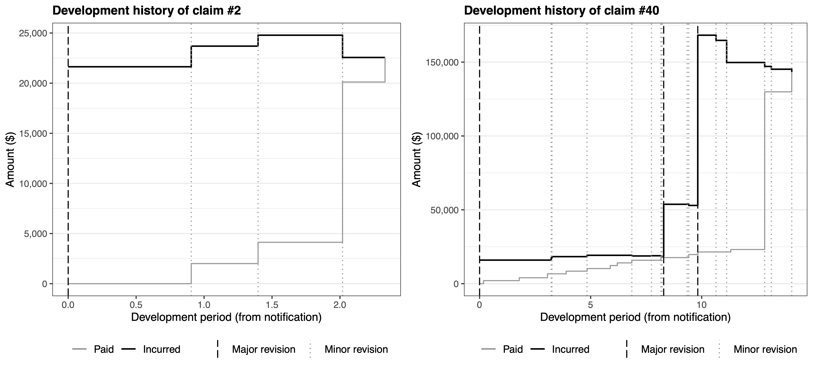

# Case estimation (3.1)

## Case estimates: Definition

- When a claim is notified, the insurer’s employee who manages the claim (the “claims adjuster”) typically formulates an estimate of the (remaining) cost of the claim and records it in the system.
- This estimate is typically adjusted over time as payments are made and additional information becomes available.
- These is called a “**case estimate**” (equivalently, “individual estimate”, “manual estimate”, “physical estimate”).
- This is contrast to an “**aggregate estimate**”, which would be inferred from past data, and some sort of statistical (reserving) procedure.

## Two approaches

You can think of the evolution of a claim costs as two parallel paths; consider those two examples (Figure 2 of Avanzi, Taylor, and Wang (2023)):

------------------------------------------------------------------------

- Contrary to the evolution of aggregate payments (which lead to the “aggregate estimate”), “incurred” estimates are meant to be centered around the expected ultimate cost from the start. Remember they are defined as
  `$$I(i,j) = D(i,j) + Q(i,j),$$`
  where `\(D(i,j)\)` are cumulative payments up to time `\(j\)`, and `\(Q(i,j)\)` is the case estimate at that same time.
- The “good” thing about case estimates is that they are specific to the claim, and are an educated, intelligent guess of the cost of them, rather than a cold, myopic statistical estimate.
- The “bad” thing is that they are very subjective, and are subject to (potentially dangerous) systematic biases.

So which one should you use?

## Proposition 3.1

Quote from Taylor (2000):

1)  When outstanding loss liability is to be estimated in respect of a **large number of claims**, an **aggregate estimate** will usually exhibit performance, as measured by the relative error R, superior to that of case estimates.
2)  When the liability is to be estimated in respect of a **small number of claims**, superior performance will usually be exhibited by **case estimates corrected for bias**.”

This is discussed/applied in Section 4.4 of Taylor (2000).

# Chain ladder (3.2)

## Introduction

- We used chain ladder for claim counts in Module 3.
- We can use it for forecasting other variables `\(Y(i,\cdot)\)` which can be expressed in the cross-classified structure (i.e. `\(i\times j\)` ) in much the same way, from a triangle of aggregate quantities
  `$$Y(i,j) = \sum_{m=0}^j X(i,m),$$`
  where `\(X(i,j)\)` are observed quantities in cell `\((i,j)\)`.
- Assumptions of proportionality can be made in much the same way, and the method applies in much the same way.
- Note that you can apply this on either paid or incurred losses (that is, `\(X\)` would be either paid losses or incurred losses), as discussed in the following two subsections.
- Applications are quite wide and apply in a range of contexts and  
  fields!

## Chain ladder on paid losses

### Introduction

- We focus on paid losses, that is,
  $$ X(i,j) = C(i,j).$$
- Hence `\(\hat{Y}(i,j)\)` will yield estimates of future loss payments in future cells `\((i,j)\)`.
- Everything else is the same as before.

### Example (unadjusted chain ladder)

- See the spreadsheet [`Chapter3.xlsx`](https://canvas.lms.unimelb.edu.au/courses/191080/modules/items/5059291) for details of the calculations. The first tab sets out payment data corresponding to the example we studied in Module 3.
- Table 3.1-3.3 demonstrate how chain ladder can be used on payment data, in absence of inflation adjusment.

### Inflation

- We are now dealing with payment data, which is typically distorted by inflation. This cannot be ignored.
- Not adjusting the data corresponds to making a rather strong assumption about inflation, as explained below.
- Remember that the asterisk `\(*\)` denoted claims data brought back/forward to some reference date, and that the quantities without `\(*\)` were nominal amounts.

------------------------------------------------------------------------

- If (as assumed in chain ladder)
  $$ E\left[ C^*(i,j) \right] = \alpha^*(i) \mu^*(j)$$
  then we have the “**inflation adjusted**” chain ladder model
  $$ E\left[ C(i,j) \right] = \alpha^*(i) \mu^*(j) \frac{\lambda(k)}{\lambda_0},$$
  to be compared with the “**unadjusted**” chain ladder model
  $$ E\left[ C(i,j) \right] = \alpha(i) \mu(j).$$
- Tables 3.1-3.3 operationalise the “unadjusted” version.

------------------------------------------------------------------------

Proposition of Taylor (2000):

*If `\(\alpha(\cdot)\)`, `\(\mu(\cdot)\)` are not restricted, then the inflation adjusted and unadjusted chain ladder models are consistent* **if an only if** *the rate of claims inflation is constant over the whole experience.*

The last sentence means that we require
`$$\frac{\lambda(k)}{\lambda(k-1)}\text{ to be constant for all }k>1.$$`

------------------------------------------------------------------------

Theorem 3.3 of Taylor (2000) implies that when claims inflation is constant at rate `\(f\)`,
`\begin{eqnarray*} \alpha(i) &=& \frac{\lambda(0)}{\lambda_0} \alpha^*(i) (1+f)^i, \\ \mu(j) &=& \mu^*(j) (1+f)^j, \text{ with}\\ \sum_j \mu^*(j) &=& 1. \end{eqnarray*}`
Note that the adjustment `\(\lambda(0)/\lambda_0\)` would typically be an adjustment due to the fact that payments are not all made on the first or last day of the periods (typically, we assume in the middle on average).

------------------------------------------------------------------------

Proposition 3.4 of Taylor (2000) states that “Similar estimates of outstanding loss liability will be produced by:

1)  the unadjusted chain ladder;
2)  the inflation adjusted chain ladder, with a future inflation rate roughly equal to the average over the period of claims experience on which the estimates are based.”

Note:

- This is because the unadjusted chain ladder age to age factors include inflation implicitly, and that these are hence similarly projected in the future.
- If inflation was very heterogeneous in the past `\(I\)` periods, and/or if it is assumed to be inconsistent with future inflation, an inflation adjusted chain ladder will lead to better forecasts (although it will require assumptions to be made about future inflation). See also Corollary 3.5 in Taylor (2000).
- Results hold by analogy in presence of superimposed inflation.

### Example (inflation adjusted chain ladder)

- See the spreadsheet [`Chapter3.xlsx`](https://canvas.lms.unimelb.edu.au/courses/191080/modules/items/5059291) for details of the calculations.
- Table 3.4 displays `\(C^*(i,j)\)` as of 31 December 1995 using the inflation index set of Appendix B.2.
  - Note the accumulation factor of 1995 is not 1; it is `\(\lambda(0)/\lambda_0\)` and likely reflects the fact that payments in cells `\(k=1995\)` were made in the middle of the year on average.
- Table 3.5 determines age to age factors, which we analyse from the point a view of the discussion above before proceeding to projections.

------------------------------------------------------------------------

- Table 3.6 compares `\(\widehat{\mu}^*(j)\)` of Table 3.5 with `\(\widehat{\mu}(j)\)` of Table 3.1.
- It is a consequence of Theorem 3.3 that
  `$$f = \left(\frac{\mu(j)}{\mu^*(j)}\right)^{1/j}-1$$`
  and hence we can derive an “implied” rate `\(f_j\)` for each period `\(j\)`:
  `$$f_j = \left(\frac{\widehat{\mu}(j)}{\widehat{\mu}^*(j)}\right)^{1/j}-1$$`
- This is also in Table 3.6, and is informative of the evolution of claims inflation over 1978-1995. The weighted average uses `\(\widehat{\mu}^*(j)\)` as weights.
- It is now clear how inflation distorted the evolution of claim payments, making them look longer tailed than the would otherwise be.

------------------------------------------------------------------------

- It is important to note that the results of Table 3.6 were influenced by our choice of age to age factors:
  - the “All” averaged factors over years 1978-1995
  - the “Last 6” over years 1989-1995
  - the “Last 3” over 1992-1995
- The average inflation rate over those years in Appendix B.2 was 6.8%, 4%, and 3.3% respectively.
- This illustrates Theorem 3.3.

------------------------------------------------------------------------

- Now Tables 3.7 and 3.8 forecast paid losses in 31/12/1995 dollar values
  - Note the forecast of \$374.8mio is evidently lower than the \$428.4mio forecast of the unadjusted chain ladder, as the latter implicitly allowed for inflation, and the former not.
- Table 3.9 lifts those forecasts to allow for future inflation
  - note the half year adjustment required for payment in the middle of the year on average
  - using 3.6% for future inflation leads to a forecast of \$421.1mio, which is very close to the unadjusted chain ladder forecast. This illustrates Proposition 3.4.

## Chain ladder on incurred losses

### Introduction

- Here we will produce a triangle of incurred losses, as an indicator of how our estimates typically evolve over time, and converge to ultimate:
  - the “aggregate” equivalent will be the incurred losses
  - the “incremental” equivalent are **adjustments** to incurrend losses
- Note that this means that factors generally won’t be `\(>1\)` since the incurred loss process is *not* a mostly nondecreasing process (as aggregate payments generally are, even though there can be negative payments sometimes); this is illustrated in the two examples of claim developments earlier.

### Example

- See the spreadsheet [`Chapter3.xlsx`](https://canvas.lms.unimelb.edu.au/courses/191080/modules/items/5059291) for details of the calculations. The first tab sets out payment data corresponding to the example we studied in Module 3.
- 

# References

Avanzi, Benjamin, Greg Taylor, and Melantha Wang. 2023. “SPLICE: A Synthetic Paid Loss and Incurred Cost Experience Simulator.” *Annals of Actuarial Science* 17 (1): 7–35.

Taylor, Greg. 2000. *Loss Reserving: An Actuarial Perspective*. Huebner International Series on Risk, Insurance and Economic Security. Kluwer Academic Publishers.

[^1]: References: Chapter 3 & 4 of Taylor (2000) \| `\(\; \rightarrow\)` 
